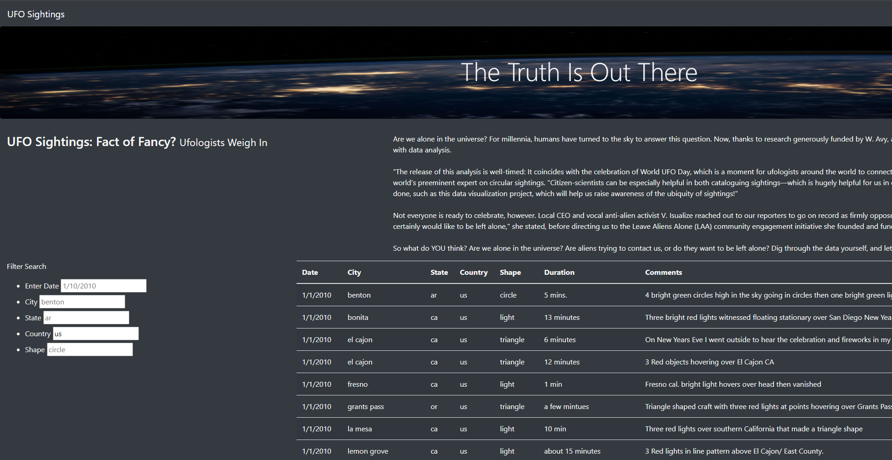
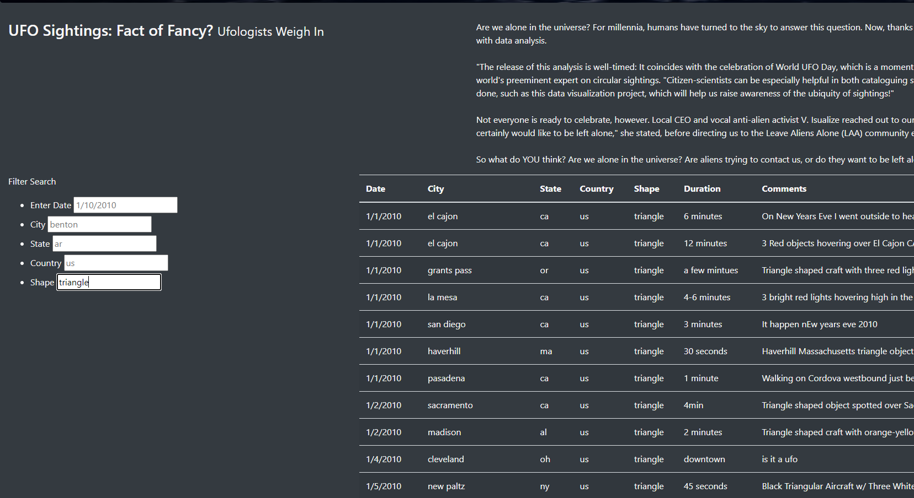
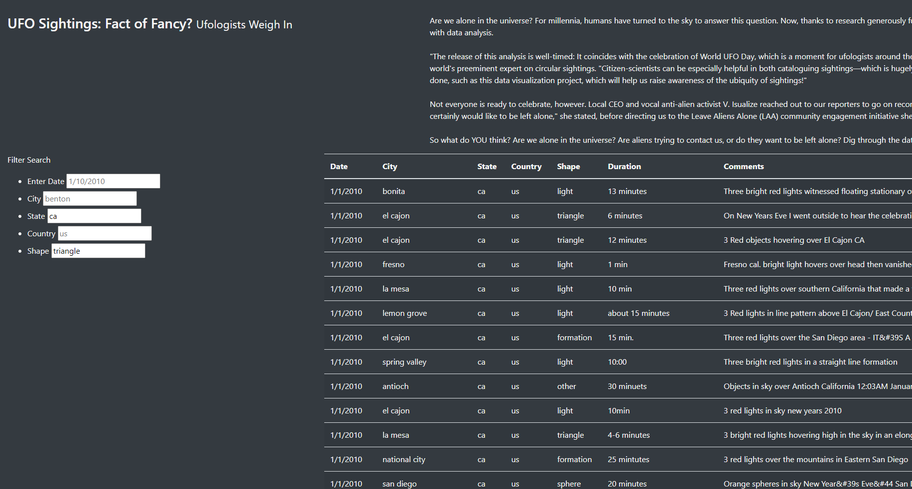

# UFOs
## Overview
This analysis and webpage will help individuals find information on various UFO events which have occurred around the world. By putting this data into one place and creating useful filters, we help people parse through immense datasets to find events specifically relevant to their own interests or research.

## Results
Using this webpage is very intuitive. Simply enter the criteria you wish to filter by into the desired category and press enter. As seen below with the country filter.

To try a new filter, delete the country data and enter a new filter into a new category. For example, shape:

You could also use two filters at once to only see events which match both criteria:

## Summary
One drawback of the way we designed this webpage is the inability to search through other categories. Two recommendations to improve the usefulness of this page:
- add the ability to filter by a range of duration values and by inclusion of specific words in the comments section.
- include data which would allow us to hyperlink to sources for each event so that site users can trace each account to the original source.